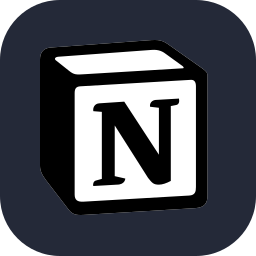

<H3> Hi! I'm Wyulle, but call me Will👋</H3> 
  

  

  
  

  <!---->
  
  

##

  <h4>About</h4>

I'm Wyulle Santos, a Software Quality (QA) professional with experience in automated testing, validating functionalities and ensuring product compliance. I manage tasks, create and administer workflows for adjustments and improvements, ensuring the performance and functionality of platforms.

I have knowledge of agile methodologies (Scrum and Kanban) and skills in tools such as Cypress, Postman, GraphQL, JavaScript and skills in organizational tools such as Jira and Azure DevOps. My experience covers front-end and back-end testing, defect management, scenario modeling and quality monitoring.

 
  <ul>
    <li>Graduated in Systems Analysis and Development</li>
    <li>Contact me: <strong>wyullesousasantos@gmail.com</strong></li>
    <li><em>from</em> <strong>Brazil, SC</strong> 📍</li>
    <li><em>If you find anything here interesting or just if you want to give me some feedback, feel free to send me a message</em>: 💭</li>
  </ul>

 

  <a href="https://github.com/s4nts">

##
  
<H4 align="left">🖥️ Technologies that I am used to:</H4>

<!--Icones no site [icogr](https://icongr.am/devicon or pesquise por badges or https://dev.to/envoy_/150-badges-for-github-pnk)-->
  

  
  
  
  
  
  
  
  
  
  
  
  
  
  

<H4 align="left"> 💭social </H4>

 
  
  
   
   
  

  
